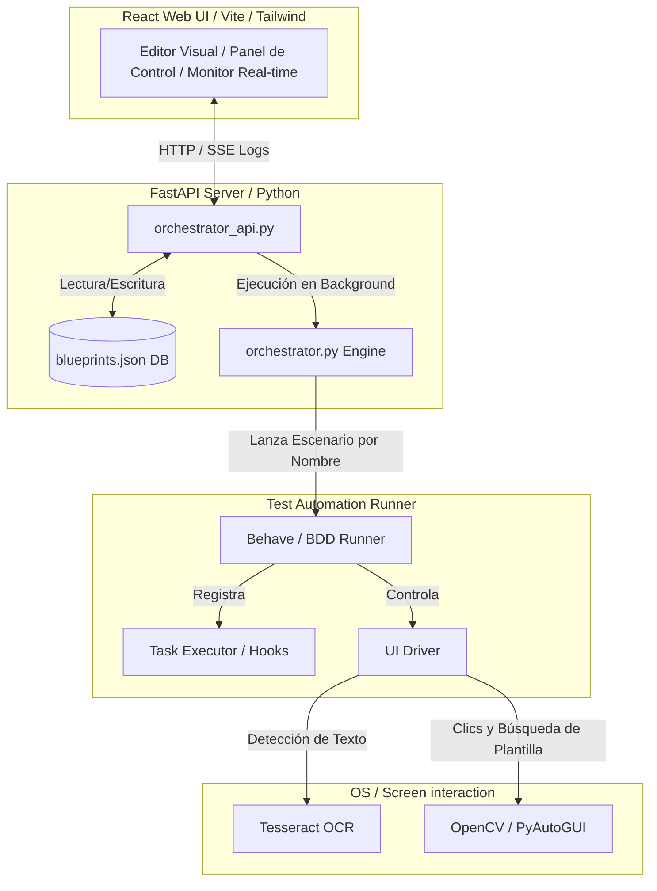

# PeHaPe — Automated UI Testing & OCR Orchestrator 🖥️🤖🧪

Plataforma avanzada de automatización y orquestación de pruebas BDD (Behavior-Driven Development). Diseñada para la validación visual y funcional de interfaces gráficas de usuario (aplicaciones de escritorio tradicionales/legacy o web) donde no hay selectores HTML o nativos disponibles. Utiliza reconocimiento de texto de alta precisión (OCR Tesseract) y procesamiento de imágenes / emparejamiento de plantillas (OpenCV).

Combina un backend FastAPI (API REST), un motor secuencial de ejecución (Orquestador), y un panel frontend interactivo (React + TypeScript) para crear, editar, ejecutar, monitorear y analizar pruebas extremo a extremo.

---

## Arquitectura y Componentes 🏗️

El sistema se compone de los siguientes módulos:



1. **Frontend (React/Vite)**: Una aplicación enriquecida que actúa como editor de features Gherkin con resaltado de sintaxis, explorador de archivos, matriz de ejecución interactiva para diseñar planes de prueba, y monitor de registros en tiempo real.
2. **Backend API (FastAPI)**: Servidor web que expone las capacidades del motor, interactúa con la base de datos de planos y permite la administración de imágenes OCR.
3. **Orquestador (Engine)**: Motor serial escrito en Python que consume la configuración del plan y ejecuta escenarios de prueba Behave de manera individual y controlada.
4. **Core de Automatización (Behave + PyAutoGUI + OCR/OpenCV)**: Ejecutor final que realiza las interacciones físicas con la pantalla basándose en el texto detectado o los recursos de imágenes suministrados.

---

## Estructura del Proyecto 📂

El repositorio está organizado de la siguiente manera:

*   [api/](file:///c:/Proyectos/ocr_test/pehape/api): Backend en FastAPI. Contiene routers, modelos Pydantic, base de datos en memoria y tareas en segundo plano.
*   [config/](file:///c:/Proyectos/ocr_test/pehape/config): Configuración del puerto de red, parámetros de coincidencia de OCR y servidor de actualizaciones automáticas.
*   [executor/](file:///c:/Proyectos/ocr_test/pehape/executor): Controladores del driver del sistema, captura de pantalla y orquestación de tareas de hooks.
*   [features/](file:///c:/Proyectos/ocr_test/pehape/features): Archivos Gherkin (.feature), definiciones de pasos en Python (`steps/`) y archivo de persistencia de planos (`blueprints.json`).
*   [frontend/](file:///c:/Proyectos/ocr_test/pehape/frontend): Código fuente de la interfaz React, webpacking y estilos premium.
*   [reports/](file:///c:/Proyectos/ocr_test/pehape/reports): Evidencias de ejecución. Almacena capturas de pantalla, archivos JSON crudos de Allure y videos/GIFs generados de cada prueba.
*   [resources/](file:///c:/Proyectos/ocr_test/pehape/resources): Directorio de imágenes de referencia localizadas por tag o compartidas genéricamente.
*   [util/](file:///c:/Proyectos/ocr_test/pehape/util): Clases de apoyo y utilidades de sistema.

### Scripts y Ejecutables Principales
*   [orchestrator.py](file:///c:/Proyectos/ocr_test/pehape/orchestrator.py): Motor secuencial que procesa las jerarquías de ejecución (Plan ➔ Ciclos ➔ Flujos ➔ Escenarios) e invoca Behave.
*   [orchestrator_api.py](file:///c:/Proyectos/ocr_test/pehape/orchestrator_api.py): Punto de entrada FastAPI para levantar el servidor y opcionalmente el cliente nativo Edge WebView2.
*   [start-all.ps1](file:///c:/Proyectos/ocr_test/pehape/start-all.ps1): Script para iniciar backend y frontend simultáneamente en entornos locales.
*   [create-offline-package.ps1](file:///c:/Proyectos/ocr_test/pehape/create-offline-package.ps1): Script que empaqueta todas las dependencias del sistema y recursos offline para su distribución en entornos aislados.

---

## Prerrequisitos ⚙️

Para ejecutar o desarrollar en esta plataforma, necesitas:

*   **Python 3.12+** (Recomendado 3.12.10)
*   **Node.js 18+** & **npm** (Para compilar y correr el Frontend)
*   **Tesseract OCR** (Asegura configurar la ruta de instalación `tesseract_cmd_path` en `config/ocr_config.json`)
*   **Java Runtime Environment (JRE)** (Requerido para generar reportes con Allure Commandline)

---

## Instalación y Configuración 🚀

### Configuración para Desarrollo

1. **Entorno Python**:
   ```powershell
   # Crear entorno virtual
   python -m venv .venv
   .\.venv\Scripts\activate

   # Instalar dependencias
   pip install -r requirements.txt
   ```

2. **Entorno Frontend**:
   ```powershell
   cd frontend
   npm install
   ```

3. **Ejecutar el entorno**:
   ```powershell
   # Levanta backend en http://localhost:5001 y frontend en http://localhost:3000
   ./start-all.ps1
   ```

### Distribución e Instalación Offline (Entornos de Producción)

Para implementar el sistema en máquinas sin conexión a Internet:

1. **Generar el Paquete**: En la máquina de desarrollo con conexión, ejecuta:
   ```powershell
   ./create-offline-package.ps1
   ```
   Esto generará un directorio independiente en `target/package_offline` con todas las dependencias `.whl` descargadas, el frontend pre-compilado, Allure CLI, y una copia portable de Tesseract OCR.

2. **Instalar en la Máquina Destino**: Copia la carpeta empaquetada a la máquina de destino y ejecuta desde PowerShell:
   ```powershell
   ./install.ps1
   ```
   Esto creará el entorno virtual local e instalará todas las librerías necesarias de manera 100% offline.

3. **Modos de Inicio Offline**:
   *   **Modo Ventana de Escritorio (Recomendado)**: Ejecuta `start-app-window.bat`. Utiliza pywebview para encapsular la aplicación en una ventana nativa de Windows (WebView2), ideal para operadores locales.
   *   **Modo Servidor/Navegador**: Ejecuta `start-all-offline.bat`. Levanta el backend FastAPI y te permite conectarte desde tu navegador preferido.

---

## Referencia de Configuración 🔌

Los archivos de configuración se encuentran en la carpeta `config/`:

*   **`network_config.json`**:
    *   `backend_host`: Dirección de red del backend (ej. `0.0.0.0` para acceso en red local).
    *   `backend_port`: Puerto de escucha del backend (default: `5001`).
    *   `frontend_port`: Puerto para el servidor de desarrollo de Vite (default: `3000`).
*   **`ocr_config.json`**:
    *   `tesseract_cmd_path`: Ruta absoluta o relativa al binario `tesseract.exe`.
    *   `tesseract_language`: Idioma de reconocimiento (default: `"spa"`).
    *   `image_confidence_threshold`: Confianza para la coincidencia de imágenes en OpenCV (0-100, default: `70`).
    *   `ocr_confidence_threshold`: Filtro de confianza para detección de palabras OCR (0-100, default: `40`).
    *   `stop_on_failure`: Si es verdadero, detiene los escenarios del behave inmediatamente al fallar.
*   **`upgrade_config.json`**:
    *   `update_url`: URL remota para comprobar actualizaciones automatizadas.
    *   `local_update_dir`: Ruta donde se guardan los paquetes de actualización.

---

## Referencia de API REST 📡

El backend expone endpoints interactivos detallados en `/docs` (Swagger UI):

| Endpoint | Método | Descripción |
| :--- | :--- | :--- |
| `/api/blueprints` | `GET` / `PUT` | Recuperar o guardar la estructura completa de planes de prueba y sus nodos. |
| `/api/execute-plan/{plan_id}` | `POST` | Encolar y ejecutar un plan completo o filtrar nodos específicos. |
| `/api/execution-status/{task_id}`| `GET` | Consultar estado (pending, running, finished, failed) y metadatos de una tarea. |
| `/api/execution-status/{task_id}/stream`| `GET` | Canal SSE que transmite los logs y eventos del orquestador en tiempo real. |
| `/api/execution-status/{task_id}/cancel`| `POST` | Cancelar una tarea que está programada o en espera de inicio. |
| `/api/reports/gherkin-results` | `GET` | Parsea los JSON de Allure para estructurar un historial visual rápido en la UI. |
| `/api/execution/{id}/gif` | `GET` | Genera y transmite dinámicamente un GIF con las capturas de pantalla de la ejecución. |
| `/api/execution/{id}/video` | `GET` | Genera y transmite dinámicamente un video MP4 con las capturas secuenciales del test. |
| `/api/ocr-images` | `GET` | Lista todos los recursos de imagen con sus metadatos y mapeos asociados. |
| `/api/images/upload` | `POST` | Sube una imagen OCR asociándola a una feature, un tag de escenario o como genérica. |
| `/api/update/check` | `POST` | Compara la versión local contra el servidor y descarga nuevos paquetes zip. |
| `/api/update/apply` | `POST` | Aplica una actualización e inicia el script autoejecutable de hot-reloading. |

---

## Coincidencia de Imágenes y Soporte Genérico 🖼️

Cuando el motor no encuentra un elemento interactivo usando OCR (texto), recurre al emparejamiento de imágenes como fallback. El motor busca los archivos de la siguiente forma:

1.  **Imágenes de Escenario Específicas**: Almacenadas con la estructura del caso de prueba:
    `resources/images/features/<module_dir>/<feature_dir>/<feature_file>/<tag_name>/<image_file>.png`
    *Ejemplo:* `resources/images/features/retiro/retiro.feature/ok/button_confirm.png`
2.  **Imágenes Genéricas**: Para iconos o botones repetitivos (ej: botón "Salir", flechas, etc.), puedes subirlos a la carpeta genérica:
    `resources/images/features/generic/<image_name>.png`
    El sistema las usará de manera automática si el texto falla y no hay una imagen específica de escenario configurada.

---

## Tareas de Configuración Previa / Hooks (Pre-Run Tasks) 📋

El sistema permite asociar tareas predefinidas en formato JSON a tus escenarios de prueba (`blueprints.json`). Estas se ejecutan en momentos específicos (`before_scenario`, `after_scenario`, `before_step`, `after_step`) a través del `TaskExecutor` de Behave.

### Tareas Integradas Soportadas
*   `limpiar_log`: Borra o vacía un archivo de registros del sistema antes de correr una prueba para garantizar aislamiento de logs.
*   `validar_existencia_log`: Valida la existencia de archivos clave del sistema como evidencia previa a la automatización.

---

## Actualización del Sistema Integrada (Auto-Update) 🔄

El orquestador cuenta con un flujo seguro de actualización en caliente:

1.  **Verificación**: `/api/update/check` descarga información del servidor remoto y comprueba si hay una versión superior a la local (`version.json`).
2.  **Descarga**: Se descarga el paquete `.zip` correspondiente en el directorio local de actualizaciones.
3.  **Extracción e Instalación**: Al aplicar la actualización (`/api/update/apply`), el servidor realiza las siguientes tareas:
    *   Extrae el paquete en una carpeta temporal.
    *   Genera un script por lotes desacoplado `temp_apply.bat`.
    *   Ejecuta el bat en una consola paralela y apaga el servidor FastAPI de manera limpia para liberar puertos.
    *   El script ejecuta `update.ps1` en PowerShell con bypass de ejecución, reemplazando la base de código pero **preservando tus configuraciones personalizadas**:
        *   `config/network_config.json` (Puertos y hosts)
        *   `config/ocr_config.json` (Ruta y thresholds de Tesseract)
        *   `features/example.feature` (Pruebas personalizadas de muestra)
        *   Las carpetas `resources/images/` y `resources/ocr_images/` (Tus imágenes de referencia OCR).
    *   Finalmente, inicia la aplicación de nuevo e informa del éxito del proceso.

---

## Resolución de Problemas (Troubleshooting) 🛠️

*   **Error: `ModuleNotFoundError: No module named 'config'`**: Asegúrate de estar ejecutando los scripts desde la raíz del proyecto. El directorio `config` contiene un archivo `__init__.py` necesario para que Python lo trate como un paquete.
*   **Tesseract no funciona o no se encuentra**: Verifica la ruta especificada en `ocr_config.json`. Si utilizas el paquete empaquetado offline, la instalación configurará la ruta relativa automáticamente.
*   **Reportes de Allure no abren o dan error 9009**: Asegúrate de tener instalado Java en tu máquina y que la variable `java` esté disponible en el PATH del sistema.
*   **Doble ejecución de escenarios**: El motor orquestador ejecuta los escenarios buscando coincidencia exacta de nombre (`--name "^NombreExacto$"`). Evita nombrar escenarios idénticos dentro del mismo archivo de feature si deseas correrlos por separado de forma CLI directo.

---

> [!TIP]
> Si deseas personalizar pasos adicionales de automatización o incorporar flujos de interacción con otro hardware, consulta los módulos del controlador en [executor/ui_executor.py](file:///c:/Proyectos/ocr_test/pehape/executor/ui_executor.py).
